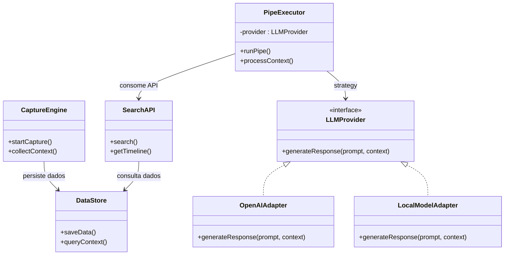

# Arquitetura e Modelagem (PJR)

**Projeto auditado:** [screenpipe/screenpipe](https://github.com/screenpipe/screenpipe)  
**Escopo principal desta auditoria:** Núcleo de captura em Rust (`screenpipe-core`), servidor de dados (`screenpipe-server`) e ecossistema de automações inteligentes (`pipes/`).

---

## 1. Fluxo Principal da Aplicação

A arquitetura do Screenpipe foi projetada para lidar com captura contínua de contexto do sistema operacional sem onerar excessivamente o processamento local.

### Etapas do fluxo:

1. **Captura Contínua (Low-Level):**  
   Os submódulos `screenpipe-vision` e `screenpipe-audio` acessam APIs nativas do sistema operacional para capturar tela, extrair texto (OCR), monitorar contexto da interface gráfica e gravar áudio em tempo real.

   O sistema prioriza APIs de acessibilidade (*Accessibility APIs*) para extração semântica de informações, utilizando OCR como mecanismo complementar.

2. **Persistência Local:**  
   Os componentes internos do ecossistema Rust processam e indexam os dados em banco local (**SQLite**), atuando como memória contínua para técnicas de **RAG (Retrieval-Augmented Generation)**.

3. **Disponibilização (API):**  
   O `screenpipe-server` disponibiliza uma API local (**REST**) responsável por expor os dados capturados de forma desacoplada da lógica de negócio.

4. **Processamento Inteligente (Pipes):**  
   Os módulos presentes no diretório `pipes/` funcionam como automações independentes responsáveis por consumir dados da API local e integrar modelos de IA para geração de resumos, insights e fluxos automatizados.

---

## 2. Separação de Responsabilidades (Separation of Concerns)

| Camada | Componentes Principais | Papel Arquitetural |
|---|---|---|
| **Núcleo de Captura (Motor)** | `screenpipe-vision`, `screenpipe-audio`, módulos Rust | Captura contínua de tela, OCR, áudio e integração com APIs nativas do sistema operacional com foco em desempenho e baixo consumo de recursos. |
| **Persistência e Interface** | `screenpipe-server`, `SQLite` | Persistência local dos dados e exposição controlada via API REST. |
| **Lógica de Negócio (Pipes)** | Diretório `pipes/`, `@screenpipe/js` (SDK) | Implementação de automações, agentes inteligentes e regras de negócio específicas. |
| **Integração de IA** | OpenAI, Anthropic, Ollama, modelos locais | Inferência, processamento contextual e geração de respostas inteligentes. |

---

## 3. Padrões Arquiteturais Identificados

Para garantir alta coesão e baixo acoplamento, o projeto utiliza padrões consolidados:

### Arquitetura Modular com Núcleo Extensível

A arquitetura apresenta características semelhantes ao padrão **Microkernel**, separando:

- **Núcleo mínimo e performático:** módulos centrais em Rust  
- **Extensões desacopladas:** Pipes independentes

Os Pipes operam de forma isolada do núcleo principal. Dessa forma, falhas em automações não interrompem o mecanismo contínuo de captura.

### Strategy

Os Pipes utilizam interfaces genéricas para provedores de IA.  
Em tempo de execução, o sistema pode alternar entre diferentes estratégias de inferência:

- OpenAI
- Anthropic
- Ollama
- modelos locais

### Adapter / Wrapper

Cada provedor de IA possui diferenças de autenticação, requisições e formatos de resposta.

Camadas adaptadoras convertem essas diferenças para interfaces internas padronizadas, reduzindo acoplamento com APIs externas.

### Arquitetura Orientada a Eventos

O sistema evita dependência excessiva de *polling* contínuo.

Grande parte do fluxo reage a eventos e mudanças contextuais do sistema operacional, reduzindo:

- consumo de CPU  
- uso de memória  
- processamento redundante

### Orquestração Assíncrona

O fluxo entre os componentes utiliza concorrência assíncrona e paralelismo controlado em Rust, permitindo:

- captura contínua  
- processamento simultâneo  
- baixa latência  
- escalabilidade  
- múltiplas automações independentes

---

## 4. Componentes para Diagrama de Classes UML

> O diagrama abaixo representa uma abstração arquitetural conceitual dos principais componentes identificados durante a auditoria.

### Lista de Componentes Centrais

- `CaptureEngine` — Motor principal responsável pela captura contínua.
- `DataStore` — Persistência e indexação local em SQLite.
- `SearchAPI` — API REST responsável por disponibilizar os dados.
- `PipeExecutor` — Executor de automações independentes.
- `LLMProvider` — Interface para provedores de inferência com IA.
- `OpenAIAdapter` — Implementação para OpenAI.
- `LocalModelAdapter` — Implementação para modelos locais.

### Relações (UML)

- `CaptureEngine` **persiste dados em** `DataStore`
- `SearchAPI` **consulta** `DataStore`
- `PipeExecutor` **consome** `SearchAPI`
- `PipeExecutor` **utiliza** `LLMProvider`
- `OpenAIAdapter` **implementa** `LLMProvider`
- `LocalModelAdapter` **implementa** `LLMProvider`

---

## 5. Diagrama UML (Mermaid)

---

## 6. Relação com Vendor Lock-in

A arquitetura do Screenpipe demonstra preocupação em reduzir dependências rígidas de fornecedores específicos de IA (*vendor lock-in*).

### Estratégias arquiteturais observadas

O sistema utiliza uma camada de abstração para provedores de modelos de linguagem, permitindo integração com diferentes serviços sem alterar significativamente as camadas superiores da aplicação.

Entre os provedores suportados ou integráveis estão:

- OpenAI
- Anthropic
- Ollama
- modelos locais

Essa abordagem reduz o acoplamento direto entre os Pipes e APIs proprietárias específicas.

### Elementos arquiteturais que mitigam Vendor Lock-in

| Estratégia | Relação com Vendor Lock-in |
|---|---|
| **Abstração de provedores (`LLMProvider`)** | Permite substituição de fornecedores sem alterar a lógica principal da aplicação. |
| **Adapter Pattern** | Isola diferenças entre APIs externas, evitando dependência estrutural de formatos proprietários. |
| **Suporte a modelos locais** | Reduz dependência exclusiva de serviços pagos em nuvem. |
| **API REST local** | Mantém desacoplamento entre captura, persistência e consumo dos dados. |
| **Pipes independentes** | Novas integrações podem ser adicionadas sem modificar o núcleo do sistema. |

### Limitações e Possíveis Pontos de Lock-in

Apesar da arquitetura reduzir dependências diretas, ainda existem potenciais pontos de acoplamento indireto:

- dependência de SDKs específicos de provedores;
- diferenças de capacidade entre modelos proprietários;
- variações de custo e limites de tokens;
- mudanças externas em APIs comerciais;
- dependência parcial do ecossistema Node.js em algumas automações.

Além disso, determinados Pipes podem ser desenvolvidos especificamente para funcionalidades exclusivas de um provedor de IA, reduzindo portabilidade entre modelos.

### Avaliação Arquitetural

De forma geral, o projeto apresenta uma arquitetura relativamente resiliente a *vendor lock-in*, principalmente devido à:

- modularidade;
- separação de responsabilidades;
- utilização de adaptadores;
- abstrações de provedores;
- suporte a modelos locais.

Essas características favorecem:

- portabilidade;
- manutenção evolutiva;
- substituição gradual de fornecedores;
- maior independência tecnológica.

---

## 7. Relação com CMMI e MPS.BR

### CMMI-DEV (Solução Técnica)

A solução evidencia maturidade na seleção da arquitetura e na distribuição de responsabilidades entre componentes especializados.

A adoção de tecnologias distintas atende objetivos específicos:

- **Rust:** captura contínua, concorrência e alta performance.
- **SQLite:** persistência local leve e eficiente.
- **TypeScript / JavaScript:** flexibilidade e rápida evolução das automações inteligentes.
- **Modelos locais e externos:** processamento contextual desacoplado.

Dessa forma, o design demonstra aderência aos princípios de **Solução Técnica**, selecionando tecnologias compatíveis com cada requisito do sistema.

### MR-MPS-SW (Projeto e Construção)

O modelo arquitetural evidencia princípios associados à modularidade e à **Inversão de Dependência (DIP / SOLID)**.

As camadas de alto nível (`Pipes`) não dependem diretamente de APIs proprietárias, mas sim de abstrações como:

- `LLMProvider`

Isso proporciona:

- maior modularidade  
- facilidade de testes  
- manutenção simplificada  
- substituição de provedores sem impacto estrutural  
- maior extensibilidade arquitetural

Caracteriza, portanto, uma solução aderente às boas práticas de **Projeto e Construção de Software**.

---

## 8. Limitações da Análise

O repositório do Screenpipe encontra-se em desenvolvimento contínuo, podendo sofrer mudanças arquiteturais frequentes.

### Pontos sujeitos a evolução

- organização interna dos módulos nativos em **Rust**
- integração com novos provedores de IA
- expansão do ecossistema de Pipes
- integração com MCP (*Model Context Protocol*)
- novas estratégias de automação inteligente

### Escopo desta auditoria

Esta análise concentrou-se no fluxo principal de captura, persistência local e desacoplamento entre núcleo e automações inteligentes.

Não foram aprofundadas rotinas internas de baixo nível, como:

- **Voice Activity Detection (VAD)**
- otimizações nativas de áudio
- detalhes internos de OCR
- gerenciamento avançado de memória
- otimizações específicas de runtime em Rust
