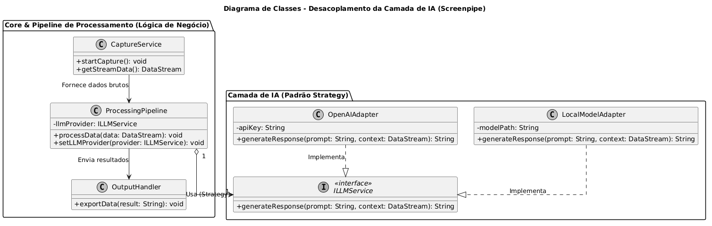

# Arquitetura e Modelagem (PJR)

**Projeto auditado:** [mediar-ai/screenpipe](https://github.com/mediar-ai/screenpipe)  
**Escopo principal desta auditoria:** Núcleo de captura em Rust (`screenpipe-core`), servidor de dados (`screenpipe-server`) e ecossistema de lógicas de negócio (`pipes/`).

---

## 1. Fluxo Principal da Aplicação

A arquitetura do Screenpipe foi projetada para lidar com captura ininterrupta de dados de hardware sem onerar a execução de modelos de IA pesados.

### Etapas do fluxo:

1. **Captura Contínua (Low-Level):**  
   Os submódulos `screenpipe-vision` e `screenpipe-audio` acessam APIs nativas do sistema operacional para capturar tela, extrair texto (OCR) e gravar áudio de microfones/sistema em tempo real.

2. **Persistência Local:**  
   O `screenpipe-core` indexa os dados brutos em banco local (**SQLite**), atuando como memória contínua para técnicas de **RAG (Retrieval-Augmented Generation)**.

3. **Disponibilização (API):**  
   O `screenpipe-server` disponibiliza uma API local (**REST/gRPC**) que expõe os dados capturados de forma segura, sem conter lógica de negócio.

4. **Processamento Inteligente (Pipes):**  
   Aplicações independentes no diretório `pipes/` (TypeScript ou Python) consomem a API e enviam os dados para provedores de IA, gerando resumos, insights e automações.

---

## 2. Separação de Responsabilidades (Separation of Concerns)

| Camada | Componentes Principais | Papel Arquitetural |
|-------|------------------------|-------------------|
| **Núcleo de Captura (Motor)** | `screenpipe-core`, `vision`, `audio` (Rust) | Abstração de hardware, captura 24/7, OCR e alta performance com baixo consumo de CPU/RAM. |
| **Persistência e Interface** | `screenpipe-server`, `SQLite` | Manutenção do estado e exposição dos dados via endpoints, separando dados e negócio. |
| **Lógica de Negócio (Pipes)** | Diretório `pipes/`, `@screenpipe/js` (SDK) | Implementação de regras de negócio específicas. |
| **Integração de IA** | `Vercel AI SDK`, `LangChain` | Gerenciamento de prompts, limites de tokens e chamadas externas para LLMs. |

---

## 3. Padrões Arquiteturais Identificados

Para garantir alta coesão e baixo acoplamento, o projeto utiliza padrões consolidados:

### Microkernel (Core + Plugins)

A arquitetura separa:

- **Núcleo mínimo e performático:** Core em Rust  
- **Módulos externos:** Pipes independentes

Se um Pipe falhar, o núcleo de captura permanece operacional.

### Strategy

Os Pipes utilizam interfaces genéricas para provedores de IA.  
Em tempo de execução, o sistema escolhe a estratégia:

- OpenAI
- Anthropic
- Ollama
- Modelos locais

### Adapter / Wrapper

Cada provedor adapta diferenças de APIs:

- REST
- gRPC
- formatos JSON distintos

Tudo é convertido para uma interface comum.

### Orquestração Assíncrona

O fluxo entre Core e Pipes é assíncrono, permitindo:

- processamento em lotes  
- múltiplos agentes  
- baixa latência  
- escalabilidade

---

## 4. Componentes para Diagrama de Classes UML

### Lista de Componentes Centrais

- `CaptureService` — Motor principal em Rust; gerencia threads de captura.
- `ProcessingPipeline` — Pipe isolado executando lógica de negócio.
- `ILLMService` — Interface para inferência com LLM.
- `OpenAIAdapter` — Implementação para OpenAI.
- `LocalModelAdapter` — Implementação para modelos locais.
- `OutputHandler` — Exportação de resultados.

### Relações (UML)

- `ProcessingPipeline` **usa** `CaptureService`
- `ProcessingPipeline` **agrega** `ILLMService`
- `OpenAIAdapter` **implementa** `ILLMService`
- `LocalModelAdapter` **implementa** `ILLMService`

---

## 5. Diagrama UML (Mermaid)

## 6. Relação com CMMI e MPS.BR

### CMMI-DEV (Solução Técnica)

A solução evidencia maturidade na seleção da arquitetura e na distribuição de responsabilidades entre componentes especializados.

A adoção de tecnologias distintas atende objetivos específicos:

- **Rust:** performance extrema, captura contínua e baixo consumo de recursos.
- **TypeScript / Python:** flexibilidade, produtividade e rápida evolução dos pipelines inteligentes.

Dessa forma, o design demonstra aderência aos princípios de **Solução Técnica**, selecionando tecnologias compatíveis com cada requisito do sistema.

### MR-MPS-SW (Projeto e Construção)

O modelo arquitetural evidencia o princípio da **Inversão de Dependência (DIP / SOLID)**.

As camadas de alto nível (`Pipes`) não dependem diretamente de módulos externos ou APIs proprietárias, mas sim de abstrações como:

- `ILLMService`

Isso proporciona:

- maior modularidade  
- facilidade de testes  
- manutenção simplificada  
- substituição de provedores sem impacto estrutural

Caracteriza, portanto, uma solução aderente às boas práticas de **Projeto e Construção de Software**.

---

## 7. Limitações da Análise

O repositório do Screenpipe encontra-se em desenvolvimento acelerado, podendo sofrer mudanças arquiteturais frequentes.

### Pontos sujeitos a evolução:

- fronteira entre módulos nativos em **Rust**
- responsabilidades delegadas ao ecossistema **Node.js**
- novos pipelines e integrações futuras

### Escopo desta auditoria

Esta análise concentrou-se no fluxo principal de extensões baseadas em IA e no desacoplamento entre captura, persistência e processamento.

Não foram aprofundadas rotinas internas de baixo nível, como:

- **Voice Activity Detection (VAD)**
- otimizações nativas de áudio
- detalhes internos de performance do Core

---
